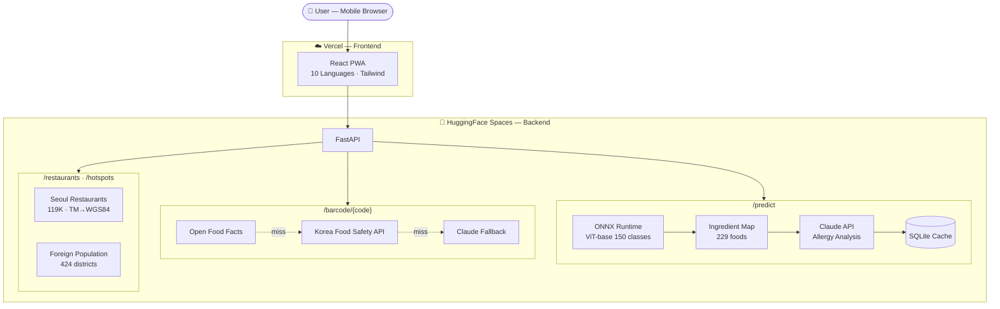

# 🍜 Allergy Scan — AI Food Allergy Safety for Everyone

> **Scan food. Stay safe. In any language.**

[](https://frontend-gocks77777s-projects.vercel.app)
[](https://cleaningsource-allergy-scan-api.hf.space/health)
[](LICENSE)

---

## The Problem

Every year, millions of tourists visit Korea. Many have food allergies — but Korean menus rarely list allergens, ingredient labels are in Korean only, and language barriers make it nearly impossible to ask staff about ingredients.

**Allergy Scan** solves this: **take a photo of any Korean food → instantly know what allergens it contains → communicate with restaurant staff in your language.**

## Key Features

| Feature | How it works |
|---|---|
| 📸 **Food Photo Recognition** | ViT deep learning model identifies Korean food → maps to ingredients → Claude AI analyzes allergy risks |
| 📱 **Barcode Scanner** | Camera scan or manual input → Open Food Facts → Korea Food Safety API → Claude fallback (3-tier) |
| 🗺️ **Restaurant Map** | GPS-based nearby restaurants from Seoul public data (119K+ restaurants), coordinate conversion |
| ⚠️ **Foreigner Hotspot Alerts** | Foreign population data × restaurant category analysis → area-specific allergen risk foods |
| 🗣️ **Two-way Interpreter** | 10 languages, STT/TTS — talk to Korean staff about your allergies in real time |
| 🌐 **Full Multilingual UI** | Korean, English, Japanese, Chinese, Spanish, French, German, Vietnamese, Thai, Arabic |

---

## Architecture



---

## Tech Stack

| Layer | Technology |
|---|---|
| **Frontend** | React 18 + TypeScript + Vite + Tailwind CSS (PWA) |
| **Backend** | FastAPI + ONNX Runtime + Anthropic Claude API + SQLite |
| **ML Model** | `google/vit-base-patch16-224` fine-tuned, 150 classes, 134,476 images |
| **Public Data** | Seoul Open Data Plaza: OA-20918 (food ingredients), OA-16094 (restaurants), OA-14993 (foreign population) |
| **External APIs** | Open Food Facts (2.7M+ products), Korea Food Safety API |
| **Infra** | Vercel (frontend) + HuggingFace Spaces Docker (backend) |
| **Total Cost** | **~$4** for the entire competition period |

---

## 🌍 Global Contribution Guide

### Your Country, Your Food, Your Contribution

This project currently supports **Korean food only** — but it's designed so that **anyone from any country can add their own cuisine using the exact same pipeline.**

> *Imagine a Japanese tourist in Thailand photographs Pad Thai and instantly knows it contains their allergens — because a Thai contributor trained the model with Thai food data. A Brazilian in Japan scans Ramen and gets warned about wheat. An Indian in Korea photographs Kimchi Jjigae and sees it's safe for them.*
>
> **That future is possible if people from each country contribute their food data.**

### How to Add Your Country's Food

```
Step 1: Collect       Step 2: Train       Step 3: Convert      Step 4: Submit
┌─────────────┐     ┌─────────────┐     ┌─────────────┐     ┌─────────────┐
│ Public food  │     │ Fine-tune   │     │ Export to   │     │ Open a      │
│ data from    │ ──► │ ViT model   │ ──► │ ONNX format │ ──► │ Pull Request│
│ your country │     │ (Colab T4)  │     │             │     │             │
└─────────────┘     └─────────────┘     └─────────────┘     └─────────────┘
```

#### Step 1 — Collect Public Food Data
Find your country's public food/ingredient/allergen datasets. Examples:
- 🇯🇵 Japan: [e-Stat](https://www.e-stat.go.jp/) food composition database
- 🇹🇭 Thailand: [Thai FDA](https://www.fda.moph.go.th/) food data
- 🇺🇸 USA: [USDA FoodData Central](https://fdc.nal.usda.gov/)
- 🇪🇺 EU: [Open Food Facts](https://world.openfoodfacts.org/)

#### Step 2 — Build Image Dataset
- Minimum **50 classes**, **500+ images per class** recommended
- 224×224 px JPEG format
- See `preprocess.py` for our preprocessing pipeline
- Structure: `data/{country_code}/{food_class}/img_001.jpg`

#### Step 3 — Fine-tune ViT Model
```bash
# Use our training notebook — runs on free Google Colab T4
notebooks/train.ipynb
```
- Base model: `google/vit-base-patch16-224`
- ~26 min for 10 epochs on Colab free T4
- FP16 training, batch size 64

#### Step 4 — Create Ingredient-Allergen Mapping
```bash
# Reference: build_ingredient_map.py
# Output format:
{
  "pad_thai": {
    "ingredients": ["rice noodles", "shrimp", "peanuts", "egg", "fish sauce"],
    "allergens": ["갑각류", "땅콩", "계란", "생선"]
  }
}
```

#### Step 5 — Convert to ONNX & Submit PR
```bash
# Convert your trained model
python -c "from optimum.onnxruntime import ORTModelForImageClassification; ..."

# Then open a Pull Request with:
# - ONNX model file
# - labels.json (class names)
# - label_ingredient_map.json (ingredient + allergen mapping)
# - Country-specific data files
```

See [CONTRIBUTING.md](CONTRIBUTING.md) for detailed requirements and PR review criteria.

---

## Getting Started

### Prerequisites
- Python 3.10+
- Node.js 18+

### Backend
```bash
cd backend
pip install -r requirements.txt

# Set environment variables
export ANTHROPIC_API_KEY=your_key_here    # Required for Claude analysis
export KFOOD_API_KEY=your_key_here        # Optional: Korea Food Safety API

# Run
uvicorn app.main:app --host 0.0.0.0 --port 8000
```

### Frontend
```bash
cd frontend
npm install
npm run dev
# Opens at https://localhost:5173 (HTTPS required for camera/mic access)
```

### Environment Variables

| Variable | Required | Description |
|---|---|---|
| `ANTHROPIC_API_KEY` | For Claude analysis | Claude API key from [Anthropic Console](https://console.anthropic.com/) |
| `KFOOD_API_KEY` | Optional | Korea Food Safety API key |
| `DATA_DIR` | Optional | Path to data directory (default: `data/`) |
| `CACHE_DB` | Optional | SQLite cache path (default: `cache.db`) |

---

## Project Structure

```
noallergyforeveryone/
├── backend/
│   ├── app/
│   │   ├── api/
│   │   │   ├── predict.py          # POST /predict — image → food → allergens
│   │   │   ├── barcode.py          # GET /barcode/{code} — 3-tier fallback
│   │   │   ├── restaurants.py      # GET /restaurants — nearby Seoul restaurants
│   │   │   └── hotspots.py         # GET /hotspots — foreigner risk areas
│   │   ├── core/
│   │   │   ├── model.py            # ONNX ViT inference engine
│   │   │   ├── claude_client.py    # Claude API wrapper (10 languages)
│   │   │   ├── data.py             # CSV loaders, coordinate conversion
│   │   │   └── cache.py            # SQLite prediction cache
│   │   └── main.py                 # FastAPI app + lifespan
│   ├── data/                       # Seoul public CSV data
│   ├── models/                     # ONNX model + labels
│   ├── Dockerfile                  # HuggingFace Spaces deployment
│   └── requirements.txt
├── frontend/
│   ├── src/
│   │   ├── pages/
│   │   │   ├── HomePage.tsx        # Camera/upload + allergy selection
│   │   │   ├── ResultPage.tsx      # Analysis results + Claude insights
│   │   │   ├── BarcodePage.tsx     # Camera barcode scanner
│   │   │   ├── MapPage.tsx         # Leaflet map + restaurant list
│   │   │   ├── TranslatePage.tsx   # Two-way STT/TTS interpreter
│   │   │   └── SplashPage.tsx      # Language selection
│   │   ├── lib/
│   │   │   ├── api.ts              # Backend API client
│   │   │   ├── i18n.ts             # 10-language translations
│   │   │   ├── speech.ts           # Web Speech API (TTS/STT)
│   │   │   └── translate.ts        # MyMemory translation API
│   │   └── App.tsx                 # Router + layout
│   └── vite.config.ts
├── notebooks/
│   ├── train.ipynb                 # ViT fine-tuning (Colab T4)
│   └── setup_drive.ipynb           # Colab Drive setup
├── scripts/
│   ├── validate_dataset.py         # Image quality validation
│   ├── validate_csv.py             # CSV format validation
│   ├── expand_ingredient_map.py    # Ingredient map expansion
│   └── verify_mapping.py           # Mapping verification
├── build_ingredient_map.py         # Generate ingredient-allergen JSON
├── preprocess.py                   # Image preprocessing pipeline
├── CONTRIBUTING.md                 # Contribution guidelines
└── plan.md                         # Full technical specification
```

---

## Seoul Open Data Used

This project uses 3 datasets from [Seoul Open Data Plaza](https://data.seoul.go.kr/) (서울 열린데이터광장):

| Dataset | ID | Usage |
|---|---|---|
| Public Meal Top Ingredients | OA-20918 | Food → ingredient mapping for allergy detection |
| Restaurant Permits | OA-16094 | 119K+ restaurant locations for nearby search |
| Short-term Foreign Population | OA-14993 | Foreigner density → area-specific allergy risk alerts |

**Cross-domain data fusion** (Food × Population) enables location-aware allergen warnings — a key differentiator for the competition.

---

## API Endpoints

| Method | Endpoint | Description |
|---|---|---|
| `POST` | `/predict` | Image → food name (top-3) + ingredients + allergen analysis |
| `GET` | `/barcode/{code}` | Barcode → product info + allergens (3-tier fallback) |
| `GET` | `/restaurants?lat=&lng=&radius=` | Nearby restaurants within radius |
| `GET` | `/hotspots` | Top 20 foreigner-dense areas with risk foods |
| `GET` | `/health` | Server + model readiness check |

---

## 한국어 안내

이 프로젝트는 **서울 열린데이터광장 데이터 활용 경진대회 (창업 부문)** 출품작입니다.

한국 음식 사진을 찍거나 바코드를 스캔하면 AI가 알레르기 위험을 분석해주는 웹앱으로, 외국인 관광객과 알레르기 환자를 위해 만들었습니다.

자세한 기술 문서는 [plan.md](plan.md)를 참고하세요.

---

## License

MIT License — see [LICENSE](LICENSE) for details.

## Contact

**정해찬** (Haechan Jeong)
- Email: gocks77777@naver.com
- GitHub: [@gocks77777](https://github.com/gocks77777)

---

<p align="center">
  <em>Started as a Seoul data competition entry. Growing into a global food safety platform.</em><br/>
  <strong>Every country that contributes makes the world safer for everyone with food allergies.</strong>
</p>
